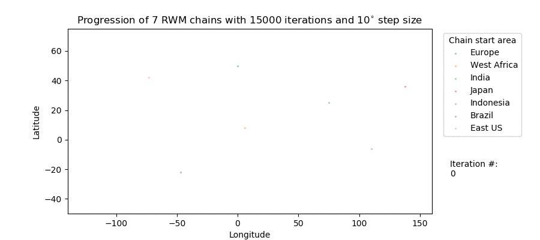

# Walking the World

Using a Random Walk Metropolis (RWM) algorithm and [data from Kaggle](https://www.kaggle.com/max-mind/world-cities-database), we attempt to randomly stumble our way around the entire world!

*Spoiler alert* - we approximate the world's population as a probability density function (we sum 2D normal distributions generated for each city) and slowly step our way around this space. As, on a global scale, the spread of cities is quite sparse, the Markov chains we create find it hard to travel between continents and so we see above that the chains struggle to converge even after 10 hours runtime. 

### Theory

Markov chain Monte Carlo (MCMC) algorithms allow us to generate respresentative samples from a potentially complex probability distirbution.

The **Random Walk Metropolis** algorithm is a widely used MCMC method that simply involves proposing new positons to move to on a probability distribution. The direction and size of the proposed step is taken from a normal distribution centred on your current locationa and with width described by the RWM's step-size. In this way, the RWM is a bit 'dumb' - depending on where we are stood on our map, we may be just as likely to propose walking into the sea as we would to the next city.

To ensure we minimise our dips in the sea, we **compare the probability density at our proposed location to our current location** (in our example this in analogous to the population density at the 2 locations). We take the ratio of these two values and then compare this a uniform random number generated between 0 and 1. If the ratio of the two probabilities is greater than or equal to the randomly generated number then we will take the step, otherwise we will stay where we are.

Putting together all the above and repeating this process for many iterations, we should eventually move around the entire probability distribution. Overall, we will spend more time in areas of high proability (cities) than we will in areas of low probability (the Atlantic!). Run for an infinite amount of time, **our sample of points visited will converge on the underlying probability distribution**.

### Significance of this project

This small project highlights some of the issues faced in **Bayesian inference** when trying to sample from an unknown, complex posterior distribution. e.g. If we were to happen to randomly initiate all of our Markov chains in Africa, we might see after 10,000 iterations that they appear to be converging. However, if we were to then assume that we have successfully explored all posterior space (the whole world), we would of course be mistaken.

If we had more time and computing power, it would be interesting to run more chains for longer preiods of time, tweaking the RWM step-size and city spread to see if we can obtain better convergence. Finally, we could also try out different MCMC methods to see see if they provide better performance.
